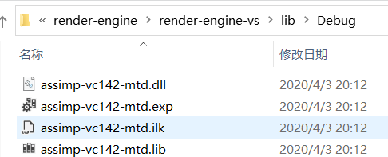
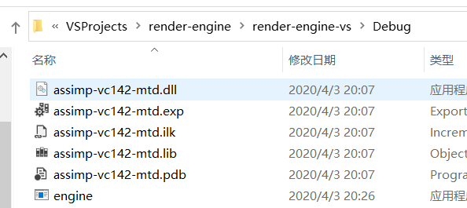

# How to Build under M$ Visual Studio

需要：

1. Visual Studio 2017 (or later)
2. Cmake 3.14+ (GUI)

步骤:

1. 在根目录下创建 cmake-Build-ms 文件夹（或者你随便叫什么别的名字都行），然后分别选项目根目录，和根目录下你新创建的那个文件夹：

2. 点一下Configure，选你的VS版本，点Finish，再点Generate
3. 如果没有问题，点Open Project，应该就可以看到你们最喜欢的VS了
4. 在左边“解决方案管理器”，选择`engine`作为启动项，并生成。
5. 运行 `engine`，如果没有出现意外，你会看到

6. 不要惊慌，这只是因为 VS build 的 runtime 并不会自动在目录下寻找 dll 文件（也是因为我cmakelists写的太垃圾了）。详见：https://cmake.org/pipermail/cmake/2012-June/050960.html

7. 为了解决这个问题，把 lib\Debug里的所以文件拷贝到Debug里。

    

8. 不出意外，再点一下运行你就可以跑了

P.S.：目前这只是非常肮脏的一种解决办法，中期等我的cmake技术提升了以后，应该会有更好的解决方案

P.P.S：如果直接用Windows下的Clion，大概率可以省去这一堆破事

P.P.P.S：如果你之前在learn opengl的过程中已经有了assimp、glm、stb_image、glfw、glad这些相关的依赖库，你也可以直接自己再配置一个imgui（implementation记得选glfw + glad），然后在你原本的环境上跑
